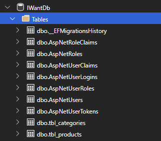

# Identity em .NET 6

# 1. Configurando

Para utilizar o ***Identity*** devemos fazer algumas configurações. Antes devemos inserir o pacote do ***Identity*** ao projeto. Podemos fazer com o comando abaixo:

```csharp
dotnet add package Microsoft.AspNetCore.Identity.EntityFrameworkCore
```

## 1.1. Contexto ou `IdentityDbContext<IdentityUser>`

 A primeira configuração é a classe de contexto do *Entity Framework* que ao invés de herdar a `DbContext` deverá herdar a classe `IdentityDbContext<IdentityUser>`. Isso ocorre porque todas as informações do usuário, `Roles`, `Claims`, etc, serão salvas no banco de dados pelo próprio *Entity Framework*. 

```csharp
using IWantApp.Domain.Products;
using IWantApp.Infra.Data.EntityTypeConfigurations;
using Microsoft.AspNetCore.Identity;
using Microsoft.AspNetCore.Identity.EntityFrameworkCore;
using Microsoft.EntityFrameworkCore;

namespace IWantApp.Infra.Data;

public class ApplicationDbContext : IdentityDbContext<IdentityUser>
{
    public DbSet<Product> Products { get; set; }
    public DbSet<Category> Categories { get; set; }

    public ApplicationDbContext(DbContextOptions<ApplicationDbContext> options) : base(options)
    {
    }

    protected override void OnModelCreating(ModelBuilder modelBuilder)
    {
        base.OnModelCreating(modelBuilder);

        new ProductEntityTypeConfiguration().Configure(modelBuilder.Entity<Product>());
        new CategoryEntityTypeConfiguration().Configure(modelBuilder.Entity<Category>());
    }
}
```

> 💡 Na classe de contexto é necessário que o método `OnModelCreating` utilize o método da super classe com `base.OnModelCreating(modelBuilder)` para que possa construir as tabelas do *identity*.

Através dessa configuração, obtemos funcionalidades como:

- Gerenciamento de usuário;
- Gerenciamento de atributos (*claims*);
- Gerenciamento de password;
- etc.

Após aplicarmos o *migration*, serão geradas as tabelas no banco de dados ***Identity*** referente a toda manipulação de usuários:



A tabela `AspNetUsers` é a tabela onde é inserida os usuários. Por padrão ela contém alguns atributos/colunas:


Outras tabelas bem importantes são:

- `AspNetRoles` que são os papeis que o usuário pode ter dentro do sistema;
- `AspNetClaims` que são os atributos do usuário. Tudo o que não foi adicicionado em `AspNetUsers` podemos adicionar na tabela de *Claims*.

## 1.2. Adicionando o *Identity* aos serviços

Finalmente, devemos configurar o ***Identity*** como um novo serviço:

```csharp
builder.Services.AddIdentity<IdentityUser, IdentityRole>()
		.AddEntityFrameworkStores<ApplicationDbContext>();
```

### 1.2.1. Configurando o nível de segurança das senhas

Algumas configurações podem ser feitas ao adicionar o ***Identity*** aos serviços, e uma delas é o nível de segurança das senhas. Por padrão ao cadastrar um `IdentityUser` será necessário uma senha forte: com letras maiúsculas e minúsculas, números, caracteres especiais, tamanho mínimo, etc. Podemos diminuir/configurar o nível da senha da seguinte forma:

```csharp
builder.Services.AddIdentity<IdentityUser, IdentityRole>(options =>
{
    options.Password.RequireNonAlphanumeric = false;
    options.Password.RequireDigit = false;
    options.Password.RequireUppercase = false;
    options.Password.RequireLowercase = false;
    options.Password.RequiredLength = 3;
}).AddEntityFrameworkStores<ApplicationDbContext>();
```

Através do `options`, existem alguns atributos ao qual podemos habilitar e desabilitar. Acima contém alguns exemplos utilizado para configurações de senhas.

# 2. Criando novos usuários

Para realizar o cadastro, precisamos criar uma rota **POST** informando os dados do usuário. De início, o **DTO** será da seguinte forma:

```csharp
namespace IWantApp.Endpoints.Employees;

public record EmployeeRequest(string Email, 
															string Password, 
															string Name, 
															string EmployeeCode);
```

Irá conter os dados de `Email` e `Password` que serão atrelados ao usuário na tabela `AspNetUser`. Também atributos como `Name` e `EmployeeCode` que são dados não presentes na tabela `AspNetUser`, mas que iremos atribuir as *Claims* da tabela `AspNetClaims`. 

Agora iremos ao método de **POST**:

```csharp
using Microsoft.AspNetCore.Authorization;
using Microsoft.AspNetCore.Identity;
using Microsoft.AspNetCore.Mvc;
using System.Security.Claims;

namespace IWantApp.Endpoints.Employees;

public class EmployeePost
{
    public static string Template => "/employees";
    public static string[] Methods => new string[] { HttpMethod.Post.ToString() };
    public static Delegate Handle => Action;

    [Authorize(Policy = "Employee005Policy")]
    public static IResult Action([FromBody] EmployeeRequest employeeRequest,
                                 [FromServices] UserManager<IdentityUser> userManager)
    {
        var user = new IdentityUser
        {
            UserName = employeeRequest.Email,
            Email = employeeRequest.Email
        };

        var result = userManager.CreateAsync(user, employeeRequest.Password).Result;

        if (!result.Succeeded)
            return Results.ValidationProblem(result.Errors.ConvertToProblemDetails());

        var userClaims = new List<Claim>
        {
            new Claim("Name", employeeRequest.Name),
            new Claim("EmployeeCode", employeeRequest.EmployeeCode)
        };

        var resultClaims = userManager.AddClaimsAsync(user, userClaims).Result;

        if (!result.Succeeded)
            return Results.ValidationProblem(resultClaims.Errors.ConvertToProblemDetails());

        return Results.Created($"{Template}/{user.Id}", user.Id);
    }
}
```

Iremos então, a partir de agora descrever cada linha do algorítmo:

- Observe que recebemos o **DTO** `EmployeeRequest` via *body* do *client*;
- Recebemos também como **Injeção de Dependência** a classe `UserManager<IdentityUser>`. Quando se trata de usuários, não utilizamos a classe de contexto para registrar e obter um usuário, e sim a `UserManager`;

Podemos ainda dividir esse algoritmo em duas partes, onde a primeira se preocupa em registrar o usuário e a segunda em registrar suas *claims*. Vamos analisar a parte de usuários:

- Primeiramente criamos um `IdentityUser`, informando o `UserName` e o `Email`. O `UserName` é um nome único (ou identificador único) do usuário, que nesse caso, utilizamos o email como referência. É a partir dela que serão feitas as buscas e a diferenciação dos usuários;
- Criamos o usuário acessando a **DI** `UserManager` através do método `CreateAsync`, onde seu primeiro parâmetro era o `IdentityUser` e o segundo a senha atribuída pelo *client* em `EmployeeRequest`;
- O retorno de `CreateAsync` é um resultado, onde podemos utilizar `result.Succeeded` para verificar se o usuário foi salvo com sucesso, e obter os erros com `result.Errors` caso não fosse salvo com sucesso;

Ao salvar as *Claims* acontece exatamente o mesmo processo:

- Criamos uma lista de *Claims* `List<Claim>` **daquele usuário, onde para *Claims* associamos os atributos `EmployeeCode` e `Name`;
- Salvamos com `UserManager` através do método `AddClaimsAsync` informando o usuário e a lista de *Claims*;
- O retorno de `AddClaimsAsync` também é um resultado e utilizamos da mesma forma que em `CreateAsync`.

# 3. Realizando consultas

Através do próprio `UserManager` podemos acessar a tabela de `Users`, porém, se for necessário os atributos contidos na tabela de *Claims* outra consulta deve ser feita. Observe abaixo como ficaria uma rota `GetAll`:

```csharp
using Microsoft.AspNetCore.Identity;
using Microsoft.AspNetCore.Mvc;

namespace IWantApp.Endpoints.Employees;

public class EmployeeGetAll
{
    public static string Template => "/employees";
    public static string[] Methods => new string[] { HttpMethod.Get.ToString() };
    public static Delegate Handle => Action;

    public static IResult Action([FromQuery] int page, [FromQuery] int rows, UserManager<IdentityUser> userManager)
    {
        var users = userManager.Users.Skip(rows*(page-1)).Take(rows).ToList();

        var employees = new List<EmployeeResponse>();

        foreach(var user in users)
        {
            var claims = userManager.GetClaimsAsync(user).Result;
            var claimName = claims.FirstOrDefault(c => c.Type == "Name");
            var userName = claimName?.Value;
            employees.Add(new EmployeeResponse(user.Email, userName));
        }

        return Results.Ok(employees);
    }
}
```

Vamos analisar esse código:

- Observamos inicialmente que se trata de uma rota que obtém todos (*GetAll*) os usuários de forma paginada, onde requer `page` e `rows`. Outra coisa importante é a injeção da dependência `UserManager<IdentityUser>`, que através dela é feitas as consultas as tabelas;
- A primeira interação do código é obtendo os usuários com `userManager.Users` de forma paginada;
- O usuário não é retornado com suas *Claims*, logo, devemos obter de cada um dos usuários. Nesse caso, obtemos somente a *claim* `Name`. Para isso:
    - Criamos uma lista de resposta `EmployeeResponse`;
    
    ```csharp
    namespace IWantApp.Endpoints.Employees;
    
    public record EmployeeResponse(string Email, string? Name);
    ```
    
    - Percorremos todos os usuários, pegamos todas as *claims* do usuário com `GetClaimsAsync`, filtramos ela procurando a com `Type == "Name"`. Se encontrada é retornado o `claimName?Value`, se não `null`. Finalmente é adicionada a lista de `EmployeeResponse` o usuário contendo seu `Email` e `Name`.

De forma clara, podemos observar que o nosso programa faz várias consultas. A primeira consulta é feita para obter todos os usuários daquele intervalo, e logo após para cada usuário é feita uma consulta de *Claims*. Observe abaixo quando retornado dois usuários, três consultas são realizadas:


O número de consultas do exemplo acima é baixa pois trata-se somente de dois usuários. A quantidade de consultas seriam $N + 1$, por exemplo, se fossem 100 usuários teriamos 101 consultas, e isso é um problema para a perfomance.

Infelizmente o ***Identity*** tem essa limitação. Uma alternativa para isso seria utilizar uma consulta SQL diretamente, fazendo um *inner join* entre as tabelas `AspNetUsers` e `AspNetUserClaims`, obtendo os dados de ambas as tabelas. Aproveitando a consulta, podemos paginar diretamente no SQL e ordenar bem mais facilmente (já que se for necessário ordenar pela *claim* é um problema). 

Para exemplificar, iremos utilizar **Dapper**: 

> 💡 Adicione a dependência através do CLI com o comando `dotnet add package Dapper`.

```csharp
using Dapper;
using Microsoft.AspNetCore.Authorization;
using Microsoft.AspNetCore.Mvc;
using Microsoft.Data.SqlClient;

namespace IWantApp.Endpoints.Employees;

public class EmployeeGetAll
{
    public static string Template => "/employees";
    public static string[] Methods => new string[] { HttpMethod.Get.ToString() };
    public static Delegate Handle => Action;

    [Authorize(Policy = "Employee005Policy")]
    public static IResult Action([FromQuery] int page, [FromQuery] int rows, [FromServices] IConfiguration configuration)
    {
        var db = new SqlConnection(configuration.GetConnectionString("SqlServerConnectionString"));

        var query = "SELECT u.Id as Id, Email, ClaimValue as Name FROM AspNetUsers u INNER JOIN AspNetUserClaims c " +
                    "ON u.Id = c.UserId and ClaimType = 'Name' " +
                    "ORDER BY Name " +
                    "OFFSET (@page - 1) * @rows ROWS FETCH NEXT @rows ROWS ONLY";

        var employees = db.Query<EmployeeResponse>(query, new { page, rows });

        return Results.Ok(employees);
    }
}
```

Faremos mais uma análise de código:

- Observe que a injeção de dependência não é mais de `UserManager`. Para utilizar o **Dapper** precisamos da DI do arquivo de configuração `appsettings.json` para acessar a string de conexão, a DI `IConfiguration`;
- Abrimos uma conexão `SqlConnection` informando a string de conexão através da DI `configuration`;
- Criamos uma *query*. Observe que essa *query* retorna o `Email` contido na tabela `AspNetUsers` e o `ClaimValue` (renomeado para `Name`) da tabela `AspNetUserClaims`. Ela faz o filtro pelo `Id` e também por `ClaimType = 'Name'`. Existe um ordenamento por `Name` e também a paginação já é inserida na *query;*
- Finalmente, obtemos os `employees` acionando a `query` com o **Dapper**.

Dessa forma para obter os dados necessários, fazemos uma única *query* ao banco de dados.

# 4. Atualizando usuários

Para atualizar um usuário criamos a rota `EmployeePut` que recebe via *body* os dados a serem alterados e um *id* via *route*. Veja abaixo como fica a nossa rota *put*:

```csharp
using Microsoft.AspNetCore.Authorization;
using Microsoft.AspNetCore.Identity;
using Microsoft.AspNetCore.Mvc;
using System.Security.Claims;

namespace IWantApp.Endpoints.Employees;

public class EmployeePut
{
    public static string Template => "/employees/{id}";
    public static string[] Methods => new string[] { HttpMethod.Put.ToString() };
    public static Delegate Handle => Action;

    [Authorize(Policy = "Employee005Policy")]
    public static IResult Action([FromServices] UserManager<IdentityUser> userManager,
                                 [FromBody] EmployeeRequest employeeRequest,
                                 [FromRoute] string id)
    {
        var user = userManager.FindByIdAsync(id).Result;

        if (user == null)
            return Results.NotFound();

        var claims = userManager.GetClaimsAsync(user).Result;

        if (claims.Count <= 0)
        {
            return Results.BadRequest();
        }

        var claimName = claims.Where(c => c.Type == "Name").SingleOrDefault();

        if (claimName == null) return Results.BadRequest();

        var claimCode = claims.Where(c => c.Type == "EmployeeCode").SingleOrDefault();

        if (claimCode == null) return Results.BadRequest();

        user.UserName = employeeRequest.Email;
        user.Email = employeeRequest.Email;
        user.PasswordHash = userManager.PasswordHasher.HashPassword(user, employeeRequest.Password);

        var result = userManager.ReplaceClaimAsync(user, claimName, new Claim("Name", employeeRequest.Name)).Result;

        if (!result.Succeeded)
            return Results.ValidationProblem(result.Errors.ConvertToProblemDetails());

        result = userManager.ReplaceClaimAsync(user, claimCode, new Claim("EmployeeCode", employeeRequest.EmployeeCode)).Result;

        if (!result.Succeeded)
            return Results.ValidationProblem(result.Errors.ConvertToProblemDetails());

        result = userManager.UpdateAsync(user).Result;

        if (!result.Succeeded)
            return Results.ValidationProblem(result.Errors.ConvertToProblemDetails());

        return Results.Ok();
    }
}
```

Assim como a rota *post*, a rota *put* recebe o `UserManager<IdentityUser>` para manipular os usuários e também `EmployeeRequest` vinda do *body*. Além desses, como comentado, o *id* pela rota.

Descreveremos rapidamente o código:

- Inicialmente obtemos o usuário através do `FindByIdAsync` informando o *id* do usuário e verificamos se não retornou `null`;
- Após verificar que o usuário foi retornado adequadamente, buscaremos pelas *claims* desse usuário com `GetClaimsAsync` informando o usuário, já que iremos modificar dados presentes nas *claims*. E também verificamos se retornou alguma *claim*;
- Buscamos através das *claims* retornadas, as *claims* que desejamos, que nesse caso é com `ClaimType` igual a `Name` e `EmployeeCode`. Depois de cada busca fazemos uma verificação se esses dados não retornaram nulo;
- Depois que temos todas as *claims* e o usuário correspondente, precisamos fazer as alterações. Modificamos então o `UserName` (nome único), `Email` e `PasswordHash`. Observe que para atribuir uma nova senha, precisamos utilizar o `userManager.PasswordHasher.HashPassword`;
- Substituimos as *claims* com o comando `ReplaceClaimAsync` que recebe o usuário, a antiga e a nova *claim*. É retornado também um resultado ao qual fazemos a verificação e retornamos um *status code* específico para error. Fazemos esse passo para as duas *claims*;
- Finalmente, através do `userManager.UpdateAsync` fazemos a atualização do usuário e a validação para verificar se foi alterado com sucesso.

# 5. Autenticação e Autorização com Json Web Token (JWT)

Para trabalhar com **JWT**, precisamos instalar uma nova dependência, a **JwtBearer**:

```csharp
dotnet add package Microsoft.AspNetCore.Authentication.JwtBearer
```

## 5.1. Criando rota de autenticação

Como já temos todo o mapeamento de usuários, precisamos a partir de agora, criar uma rota de autenticação, na qual, após suas credenciais serem verificadas receberá um token válido. Abaixo vamos criar essa rota:

```csharp
using IWantApp.Services;
using Microsoft.AspNetCore.Authorization;
using Microsoft.AspNetCore.Identity;
using Microsoft.AspNetCore.Mvc;

namespace IWantApp.Endpoints.Auth;

public class GenerateTokenPost
{
    public static string Template => "/token";
    public static string[] Methods => new string[] { HttpMethods.Post.ToString() };
    public static Delegate Handle => Action;
    
    [AllowAnonymous]
    public static IResult Action([FromBody] LoginRequest loginRequest, 
                                 [FromServices] UserManager<IdentityUser> userManager,
                                 [FromServices] IJwTUtils jwTUtils)
    {
        var user = userManager.FindByEmailAsync(loginRequest.Email).Result;

        if (user == null)
            return Results.BadRequest();

        if (!userManager.CheckPasswordAsync(user, loginRequest.Password).Result)
            return Results.BadRequest();

        return Results.Ok(jwTUtils.GenerateAccessToken(user));
    }
}
```

Iremos a partir de agora fazer uma análise de código:

- Recebemos via *body* o `LoginRequest` que contém o email e senha do usuário. Recebemos também duas injeções de dependência:
    - Uma é o `UserManager<IdentityUser>` que é usado para verificar se as credenciais informadas são válidas;
    - O `IJwtUtils` que é a classe de serviço responsável por construir um *token* com base em um usuário.
- Inicialmente obtemos o `user` com base no seu email com `FindByEmailAsync`. Verificamos ainda se ele não é nulo;
- Com `userManager.CheckPasswordAsync` podemos verificar se a senha informada corresponde a senha do usuário, para isso, precisamos informar o `user` e o *password* informado pelo *client*;
- Com o usuário validado, devemos gerar o *token* de acesso. Para isso utilizamos a classe de serviços `JwtUtils` para gerar um novo *access token*.

Já a implementação da classe `JwtUtils` segue abaixo:

```csharp
using Microsoft.AspNetCore.Identity;

namespace IWantApp.Services;

public interface IJwTUtils
{
    string GenerateAccessToken(IdentityUser user);
}
```

```csharp
using Microsoft.AspNetCore.Identity;
using Microsoft.IdentityModel.Tokens;
using System.IdentityModel.Tokens.Jwt;
using System.Security.Claims;
using System.Text;

namespace IWantApp.Services;

public class JwTUtils : IJwTUtils
{
    private readonly UserManager<IdentityUser> _userManager;
    private readonly IConfiguration _configuration;

    public JwTUtils(UserManager<IdentityUser> userManager, IConfiguration configuration)
    {
        _userManager = userManager;
        _configuration = configuration;
    }

    public string GenerateAccessToken(IdentityUser user)
    {
        // Subject create with userClaims
        var userClaims = _userManager.GetClaimsAsync(user).Result;

        var subject = new ClaimsIdentity(new Claim[]
        {
            new Claim(ClaimTypes.NameIdentifier, user.Id),
            new Claim(ClaimTypes.Email, user.Email),
        });

        subject.AddClaims(userClaims);

        // Secret key
        var key = Encoding.ASCII.GetBytes(_configuration["JwtBearerTokenSettings:SecretKey"]);

        // Create token descriptor
        var tokenDescriptor = new SecurityTokenDescriptor
        {
            Subject = subject,
            SigningCredentials = new SigningCredentials(new SymmetricSecurityKey(key), SecurityAlgorithms.HmacSha256Signature),
            Audience = _configuration["JwtBearerTokenSettings:Audience"],
            Issuer = _configuration["JwtBearerTokenSettings:Issuer"],
            Expires = DateTime.UtcNow.AddSeconds(double.Parse(_configuration["JwtBearerTokenSettings:ExpiryTimeInSeconds"]))
        };

        // Generating token
        var tokenHandler = new JwtSecurityTokenHandler();

        var token = tokenHandler.CreateToken(tokenDescriptor);

        return tokenHandler.WriteToken(token);
    }
}
```

Observe que esse serviço recebe duas injeções de dependência: recebe `UserManager<IdentityUser>` que a partir dela montamos as *claims*/*subject* para construir o *token*; recebe também as configurações do *token* descritos no arquivo de configuração `appsettings.json`, através da DI `IConfiguration`. Agora iremos descrever o método `GenerateAccessToken`:

- Este método recebe um `IdentityUser` e retorna uma string contendo o *access token*;
- Inicialmente ela usa o `UserManager<IdentityUser>` para obter as *claims* do usuário;
- Cria um subject para o `TokenDescriptor` já com algumas *claims* configuradas e depois adiciona as *claims* do usuário a ela;
- Obtém a *secret key* contida no arquivo de configuração e transforma *encoding* para ASCII;
- Criamos um `SecurityTokenDescriptor`, informando as caracteristicas do *token*;
- Obtemos um `JwTSecurityTokenHandler` para criar o nosso *token* baseado no `tokenDescriptor`;
- Finalmente, retornamos o *token*.

## 5.2. Configurando no `program.cs` e `appsettings.json`

Primeiramente, iremos colocar as configurações do *token* no arquivo de configuração:

```csharp
"JwtBearerTokenSettings": {
    "SecretKey": "A@fderwfQQSDXCCer34",
    "Audience": "Audience",
    "Issuer": "IWantAppIssuer",
    "ExpiryTimeInSeconds": 60
  }
```

Onde:

- A *Secret Key* é a chave secreta responsável por descriptografar o *token*;
- O *Issuer* é quem fabrica o *token*. Podemos definir o nome do emissor, como nesse caso inserimos o nome da aplicação;
- O *Audience* é quem está sendo beneficiado com esse *token*. Normalmente é inserido o *url*;
- O *ExpiryTimeInSeconds* é o tempo em segundos para o *token* expirar.

E a partir de agora iremos configurar na classe `program.cs` todas as configurações de autenticação e autorização. Começando pela injeção dos serviços:

```csharp
builder.Services.AddAuthorization();
builder.Services.AddAuthentication(x =>
{
    x.DefaultAuthenticateScheme = JwtBearerDefaults.AuthenticationScheme;
    x.DefaultChallengeScheme = JwtBearerDefaults.AuthenticationScheme;
}).AddJwtBearer(options =>
{
    options.TokenValidationParameters = new TokenValidationParameters
    {
        ValidateActor = true,
        ValidateAudience = true,
        ValidateLifetime = true,
        ValidateIssuerSigningKey = true,
        ValidIssuer = builder.Configuration["JwtBearerTokenSettings:Issuer"],
        ValidAudience = builder.Configuration["JwtBearerTokenSettings:Audience"],
        IssuerSigningKey = new SymmetricSecurityKey(Encoding.UTF8.GetBytes(builder.Configuration["JwtBearerTokenSettings:SecretKey"]))
    };
});
```

Com a adição aos serviços informamos ao [ASP.NET](http://ASP.NET) que iremos trabalhar com authenticação **JWT Bearer**. Além disso informamos as configurações do parâmetros do *token*: informamos que todos os dados como *actor, audience, lifetime, issuer, etc*, serão validados para a aceitação do *token*.

Além dos serviços, precisamos informar que iremos utilizar:

```csharp
// Nesta ordem
app.UseAuthentication();
app.UseAuthorization();
```

## 5.3. Autorização

Com as decorações de `[Authorize]` e `[AllowAnonymous]` podemos definir quem acessa ou não a rota. Através do `[Authorize]` indicamos que a rota só pode ser acessada por uma pessoa que tem autorização (foi autenticada) e com a `[AllowAnonymous]` definimos que uma rota pode ser acessada por qualquer pessoa, seja ela com autorização ou não. Veja o exemplo de rotas que utilizam os decoradores:

```csharp
using Microsoft.AspNetCore.Authorization;
using Microsoft.AspNetCore.Identity;
using Microsoft.AspNetCore.Mvc;
using System.Security.Claims;

namespace IWantApp.Endpoints.Employees;

public class EmployeePost
{
    public static string Template => "/employees";
    public static string[] Methods => new string[] { HttpMethod.Post.ToString() };
    public static Delegate Handle => Action;

    [Authorize(Policy = "Employee005Policy")]
    public static IResult Action([FromBody] EmployeeRequest employeeRequest,
                                 [FromServices] UserManager<IdentityUser> userManager)
    {
        var user = new IdentityUser
        {
            UserName = employeeRequest.Email,
            Email = employeeRequest.Email
        };

        var result = userManager.CreateAsync(user, employeeRequest.Password).Result;

        if (!result.Succeeded)
            return Results.ValidationProblem(result.Errors.ConvertToProblemDetails());

        var userClaims = new List<Claim>
        {
            new Claim("Name", employeeRequest.Name),
            new Claim("EmployeeCode", employeeRequest.EmployeeCode)
        };

        var resultClaims = userManager.AddClaimsAsync(user, userClaims).Result;

        if (!result.Succeeded)
            return Results.ValidationProblem(resultClaims.Errors.ConvertToProblemDetails());

        return Results.Created($"{Template}/{user.Id}", user.Id);
    }
}
```

```csharp
using Dapper;
using Microsoft.AspNetCore.Authorization;
using Microsoft.AspNetCore.Mvc;
using Microsoft.Data.SqlClient;

namespace IWantApp.Endpoints.Employees;

public class EmployeeGetAll
{
    public static string Template => "/employees";
    public static string[] Methods => new string[] { HttpMethod.Get.ToString() };
    public static Delegate Handle => Action;

    [Authorize(Policy = "Employee005Policy")]
    public static IResult Action([FromQuery] int page, [FromQuery] int rows, [FromServices] IConfiguration configuration)
    {
        var db = new SqlConnection(configuration.GetConnectionString("SqlServerConnectionString"));

        var query = "SELECT u.Id as Id, Email, ClaimValue as Name FROM AspNetUsers u INNER JOIN AspNetUserClaims c " +
                    "ON u.Id = c.UserId and ClaimType = 'Name' " +
                    "ORDER BY Name " +
                    "OFFSET (@page - 1) * @rows ROWS FETCH NEXT @rows ROWS ONLY";

        var employees = db.Query<EmployeeResponse>(query, new { page, rows });

        return Results.Ok(employees);
    }
}
```

### 5.3.1. Autorização por default

Por *default* todas as rotas podem ser acessadas sem autenticação/autorização caso elas não estejam decoradas com `[Authorize]`. Podemos modificar esse *default*, fazendo com que todas as rotas precisem de autenticação/autorização e somente as decoradas com `[AllowAnonymous]` possam ser acessadas por todos.

Para fazer isso precisamos configurar dentro do `AddAuthorization`:

```csharp
builder.Services.AddAuthorization(options =>
{
    options.FallbackPolicy = new AuthorizationPolicyBuilder()
        .AddAuthenticationSchemes(JwtBearerDefaults.AuthenticationScheme)
        .RequireAuthenticatedUser()
        .Build();
});
```

Dentro informamos a política padrão de autorização.

A partir desse momento o cenário muda: todas as rodas não decoradas (ou decoradas com `[Authorize]`) necessitarão de autenticação/autorização, e somente as que foram decoradas com `[AllowAnonymous]` estão disponíveis para serem acessadas sem um *token*.

### 5.3.2. Policies

As *policies* (ou políticas) usadas na autorização permite que usuários acessem determinadas rotas se a política especificada for aceita em seus critérios. Para configurar uma nova *policy*, é necessário informar dentro de `AddAuthorization` na classe `program.cs`:

```csharp
builder.Services.AddAuthorization(options =>
{
    options.AddPolicy("EmployeePolicy", p => p.RequireAuthenticatedUser().RequireClaim("EmployeeCode"));
    options.AddPolicy("Employee005Policy", p => p.RequireAuthenticatedUser().RequireClaim("EmployeeCode", "005"));
});
```

A criação de uma nova *policy* se da pelo `AddPolicy` onde seu primeiro parâmetro é o nome da política e o segundo uma função lambda configurando as condições de aceitação da política. Essas condições são:

- `RequireAuthenticatedUser()` ou seja, o usuário precisa estar autenticado;
- `RequireClaim()` ou seja, somente se o usuário estiver aquela *claim* em específico. Veja que existem sobrescritas desse método, a primeira que contém somente `ClaimType` de nome `EmployeeCode`. A segunda sobrescrita também compara o valor da `ClaimValue`, ou seja, somente se a `ClaimType` ***EmployeeCode*** for igual a `ClaimValue` **005**.

> 💡 Outras condições estão disponíveis para inserir na política. Uma bem utilizada também é a `RequireRole`.

A partir de agora, todas as rotas que queremos autorizar somente usuários que seguem a política `Employee005Policy`, ou seja, tenha ***EmployeeCode*** igual a ***005***, devem utilizar o decorador `[Authorize(Policy = "Employee005Policy")]`, ou seja, informando a política. Vejam abaixo um exemplo:

```csharp
using Dapper;
using Microsoft.AspNetCore.Authorization;
using Microsoft.AspNetCore.Mvc;
using Microsoft.Data.SqlClient;

namespace IWantApp.Endpoints.Employees;

public class EmployeeGetAll
{
    public static string Template => "/employees";
    public static string[] Methods => new string[] { HttpMethod.Get.ToString() };
    public static Delegate Handle => Action;

    [Authorize(Policy = "Employee005Policy")]
    public static IResult Action([FromQuery] int page, [FromQuery] int rows, [FromServices] IConfiguration configuration)
    {
        var db = new SqlConnection(configuration.GetConnectionString("SqlServerConnectionString"));

        var query = "SELECT u.Id as Id, Email, ClaimValue as Name FROM AspNetUsers u INNER JOIN AspNetUserClaims c " +
                    "ON u.Id = c.UserId and ClaimType = 'Name' " +
                    "ORDER BY Name " +
                    "OFFSET (@page - 1) * @rows ROWS FETCH NEXT @rows ROWS ONLY";

        var employees = db.Query<EmployeeResponse>(query, new { page, rows });

        return Results.Ok(employees);
    }
}
```